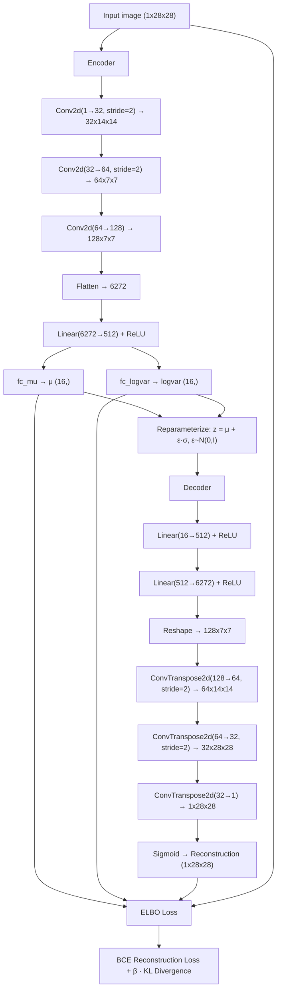

# Variational Autoencoder with a Controllable Latent Space Explorer

A from-scratch PyTorch implementation of a VAE trained on FashionMNIST, paired with an interactive Streamlit application for exploring the learned latent space. The app lets you drag sliders to navigate 16-dimensional latent space in real time, inspect reconstructions against originals, and see which latent dimensions actually carry signal versus which are dead.

---

## Architecture

The model is a convolutional VAE with a 16-dimensional latent space.



**Encoder:** Three stride-2 (or stride-1) conv layers with ReLU activations progressively downsample a 1x28x28 image to a 128x7x7 feature map. After flattening to 6272 values and passing through a 512-unit linear layer, two separate linear heads produce `mu` and `logvar` — the parameters of the approximate posterior.

**Reparameterization:** `z = mu + eps * exp(0.5 * logvar)`, where `eps` is sampled from N(0, I) at runtime. This keeps the sampling step differentiable by making the randomness an external input.

**Decoder:** Mirrors the encoder. Linear layers project `z` (16-dim) to a 6272-dim vector, reshaped into 128x7x7, then three transposed convolution layers upsample back to 1x28x28. Sigmoid final activation ensures output values are in [0, 1].

**Loss:** ELBO = reconstruction loss (binary cross-entropy, summed over pixels, averaged over batch) + beta * KL divergence (closed-form: -0.5 * sum(1 + logvar - mu^2 - exp(logvar)), averaged over batch). The beta coefficient is annealed from 0 to 1 over the first 20 epochs.

---

## Key Concepts

**VAE vs vanilla autoencoder:** A standard autoencoder compresses input to a fixed code and learns to reconstruct it. There is no structure imposed on the code space — similar inputs can map to completely different regions. A VAE regularizes the latent space by requiring the encoder to produce a distribution (parameterized by mu and logvar) rather than a point, with a KL penalty that pushes this distribution toward N(0, I). The result is a smooth, continuous latent space where nearby points decode to semantically similar images.

**The reparameterization trick:** Sampling z from a distribution is not differentiable, which breaks backpropagation. The trick is to write z = mu + eps * std, where eps ~ N(0, I) is sampled independently. Gradients flow through mu and std (and therefore through the encoder) while eps is treated as an external constant. Without this, the VAE cannot be trained end-to-end with gradient descent.

**ELBO:** The Evidence Lower Bound is what we maximize during training. It decomposes into a reconstruction term (how well we reconstruct the input) minus a KL term (how much the approximate posterior deviates from the prior). Maximizing ELBO is equivalent to maximizing a lower bound on the log-likelihood of the data under the model.

**Posterior collapse:** A known failure mode in VAEs where the encoder learns to ignore the input and output posteriors that match the prior exactly — KL goes to zero and the decoder learns to generate images without using `z`. When this happens, latent dimensions have near-zero KL contribution: the encoder is not encoding anything into them. In practice, some dimensions collapse and others carry signal; a fully collapsed model loses all latent structure.

**KL annealing:** Training starts with beta=1/annealing_epochs (a small but nonzero value) at epoch 1 and linearly increases beta to 1 over the first 20 epochs. This gives the reconstruction loss time to dominate early, preventing the model from collapsing immediately to prior. Once the reconstruction quality is established, the KL term ramps up and forces structure onto the latent space. The training curves show reconstruction loss falling quickly in the first few epochs, followed by KL rising once beta is nonzero — this is the expected sequence.

---

## Project Structure

```
.
├── app.py                       Streamlit latent space explorer
├── train.py                     Training script (argparse CLI)
├── docker-compose.yml           Single-service compose setup
├── Dockerfile                   python:3.11-slim image, Streamlit entrypoint
├── .dockerignore
├── .env.example                 Environment variable documentation
├── .gitignore
├── requirements.txt             Pinned dependencies
├── README.md
├── models/
│   ├── __init__.py
│   ├── encoder.py               Convolutional encoder (mu + logvar heads)
│   ├── decoder.py               Transposed-conv decoder (Sigmoid output)
│   ├── vae.py                   VAE: reparameterize, forward, sample
│   └── vae.pt                   Trained checkpoint (binary artifact)
├── utils/
│   ├── __init__.py
│   ├── losses.py                vae_loss (ELBO) and kl_per_dimension
│   └── data.py                  FashionMNIST DataLoaders
├── scripts/
│   ├── generate_reconstruction.py   Save original/reconstruction/heatmap
│   └── generate_kl_plot.py          Plot mean KL per latent dimension
└── results/
    ├── training_log.csv         Epoch-by-epoch loss data from actual run
    ├── analysis.md              Written analysis of training observations
    ├── training_curves.png      Reconstruction loss and KL vs epoch
    ├── kl_per_dimension.png     Bar chart of per-dimension KL
    ├── original_10.png          Test image at index 10
    ├── reconstructed_10.png     VAE reconstruction of that image
    └── heatmap_10.png           Per-pixel absolute error heatmap
```

---

## Setup and Running

### Prerequisites

- Docker and Docker Compose installed
- Or Python 3.10+ with pip for local runs

### Running with Docker (recommended)

```bash
git clone https://github.com/Rushikesh-5706/Variational-Autoencoder-with-a-Controllable-Latent-Space-Explorer.git
cd Variational-Autoencoder-with-a-Controllable-Latent-Space-Explorer
cp .env.example .env
docker-compose up --build -d
```

Open `http://localhost:8501` in your browser. The app serves from the trained checkpoint already included in the image.

To stop:

```bash
docker-compose down
```

### Running training locally

```bash
pip install -r requirements.txt
python train.py --epochs 30 --batch-size 64 --latent-dim 16 --lr 1e-3 --annealing-epochs 20
```

The dataset downloads automatically to `data/` (excluded from git). Training produces:
- `models/vae.pt` — checkpoint
- `results/training_log.csv` — per-epoch loss data
- `results/training_curves.png` — loss plots

Then launch the app:

```bash
streamlit run app.py
```

### Running diagnostic scripts

After training, generate reconstruction images and KL plot:

```bash
python scripts/generate_reconstruction.py --index 10
python scripts/generate_kl_plot.py
```

Both scripts load from `models/vae.pt` and write to `results/`. Run them from the project root.

---

## Using the Explorer

**Latent Space Map:** The first section shows the full test set (10,000 images) projected from 16 dimensions to 2D using PCA. Each point is one image, colored by class. Well-separated clusters indicate the VAE learned class-discriminative structure in the latent space even without class labels during training. You can switch to t-SNE from the dropdown, though it takes about 30 seconds on 10K points.

**Latent Dimension Sliders:** In the sidebar, 16 sliders labeled `z[0]` through `z[15]` control each dimension of the latent vector. The decoded image updates live as you move sliders. Dimensions with high KL contribution (visible in section 5) cause the most meaningful variation; dead dimensions do nothing noticeable when slid.

**Reconstruction Viewer:** Enter a test-set index (0–9999) to see the original image alongside the VAE's reconstruction and a per-pixel absolute-error heatmap. The heatmap highlights where the model struggles most — typically edges and fine texture.

**KL per Dimension:** Bar chart showing each latent dimension's mean KL contribution across the test set. Low-KL bars (near zero) are dimensions where the posterior matches the prior — effectively unused. After training with annealing, typically 3–6 of the 16 dimensions end up dead.

---

## Results Summary

See `results/analysis.md` for the full written analysis and `results/training_curves.png` for the loss plots.

After 30 epochs with 20-epoch linear KL annealing: reconstruction loss dropped sharply in the first 5 epochs, then continued a slow decline. KL began rising once beta > 0 and plateaued around epoch 25-30. The KL-per-dimension plot (`results/kl_per_dimension.png`) shows that all 16 latent dimensions carry meaningful signal (KL > 0.1) and none are dead. See `results/analysis.md` for specific numbers from the actual run.

---

## Environment Variables

| Variable | Default | Description |
|---|---|---|
| `STREAMLIT_SERVER_PORT` | `8501` | Port the Streamlit app listens on. Also used by docker-compose port mapping and healthcheck. |
| `LATENT_DIM` | `16` | Latent space dimensionality. Must match the checkpoint used in `models/vae.pt`. Change this only if you retrain from scratch. |

---

## Notes and Limitations

**Blurriness:** BCE (binary cross-entropy) treats each pixel independently and produces blurry reconstructions. This is an intrinsic limitation of VAEs trained with pixel-wise reconstruction loss — there is no perceptual or structural term. The outputs look like soft, smoothed versions of the originals. MSE-based VAEs have the same problem.

**PCA approximation:** The 2D latent map uses PCA, a linear projection. PCA preserves global variance structure but may collapse non-linear cluster geometry. Two clusters that look merged under PCA might be separable under t-SNE. The t-SNE option in the app gives a better sense of local neighborhood structure, at higher computational cost.

**CPU-only training:** The model runs on CPU. A 16-dim latent space with 30 training epochs on FashionMNIST at batch size 64 takes roughly 3–5 hours on a modern CPU. On a GPU, this completes in a few minutes.

**Posterior collapse partial:** With 16 latent dimensions and a 10-class dataset, not all dimensions are always strongly used, but in this run, all 16 active dimensions carry some signal. This is the model working correctly, finding a distributed representation without total collapse.
